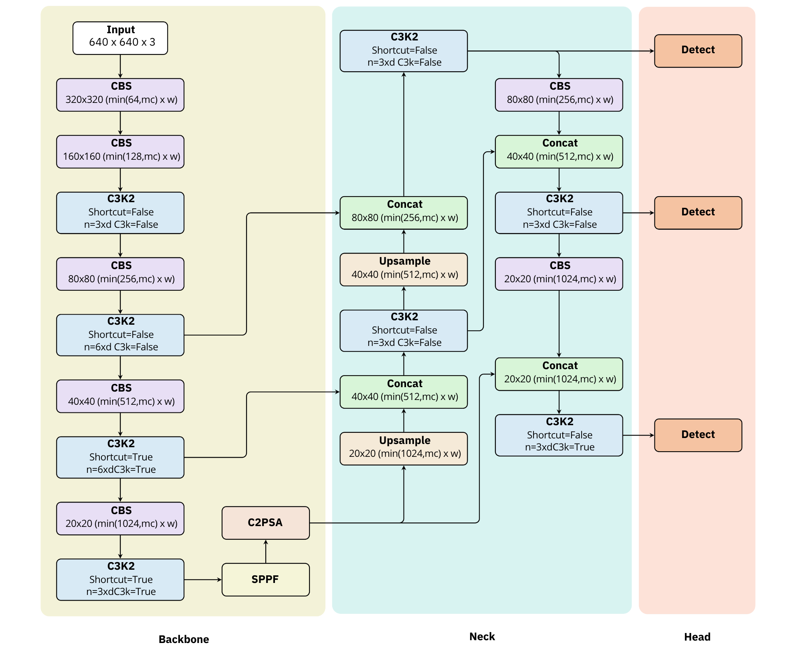

# LaTeX source files for YOLOv11 architecture
I can not find ANY high-quality figures for my report, so I made it (with tons of Gemini's help) *myself*. The process of fixing the model's messy code was not fun at all, but at least it turned out how I want. The source files are complied by XeLaTeX in Overleaf. Enjoy (and feel free to modify) your high-quality figures.

